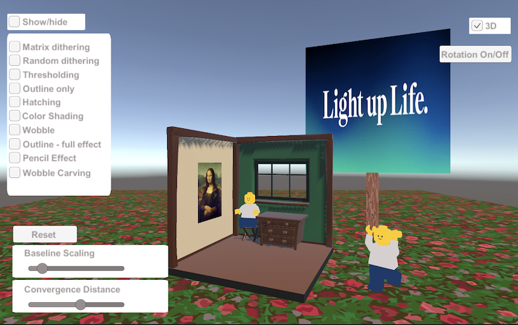
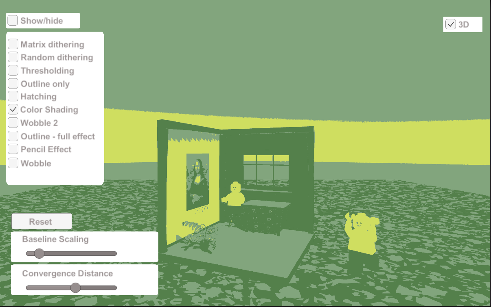

# Non-realistic effects on Lume Pad
## Bachelor's thesis VUT FIT
Author: Aneta Chalivopulosova

Year: 2023

### Information

This bachelor's thesis focuses on methods of non-realistic rendering on Lume Pad. This thesis aims to test the functionality, quality, and user-friendliness of a few selected non-realistic effects applied to 3D scenes on the holographic tablet Lume Pad. An application is used for testing.

Used effects: edge detection, ordered dithering, random dithering, thresholding, hatching, color shading, wobbling effect and wobble carving effect, and pencil effect.

### How to use

A)
Application uses Unity, version 2021.2.11f1.
To build application on Lume Pad select the Android build option.
Then copy EffectsApp.apk to Lume Pad and install the app.

B)
Use release apk.

### Images

